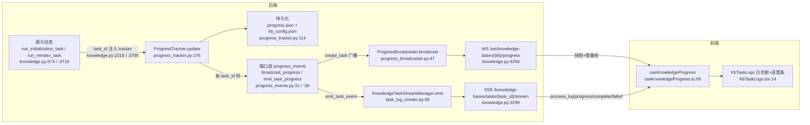

# 事件与进度链路代码导读（guide-events-2026-10-04）

- 基线：`origin/dev @ fe003ddce`（v1.6.12）。
- 范围：`deeptutor/events/event_bus`（全局事件总线）、KB 进度上报与 WS 广播、任务事件与前端 Activity 的衔接、事件丢失/乱序的既有防护；文末与 fix-progress-\* 系列卡结论互引。
- 行号锚均为该基线下的 `path:line`，相对仓库根目录。

## 0. 全景：三条链路

DeepTutor 里"事件"不是一条总线，而是三条各自独立的链路，读代码时先分清：

| 链路 | 生产者 | 载体 | 消费者 | 现状 |
| --- | --- | --- | --- | --- |
| A. KB 进度/任务事件 | 索引任务（ProgressTracker） | 双通道：WS 广播 + SSE 任务流 | `useKnowledgeProgress` → 日志框/进度条 | 主线，即 fix-progress-\* 系列对象 |
| B. 全局 EventBus | orchestrator / partners 完成事件 | 进程内单例队列 | **当前无任何生产订阅者** | 火后不理的事实审计钩子 |
| C. 会话/书/伙伴/学习活动流 | StreamBus、book hub、partner feed、mastery hub | 各自的 WS/SSE | 聊天 ActivityStack、书页、伙伴面板 | 各自带重放/续传机制 |

链路 A 的端到端流转（bus→WS→前端，验收点 1）：



## 1. 全局事件总线 `deeptutor/events/event_bus.py`

- 数据结构：`Event`（type/task_id/agent_output/event_id/timestamp，:31-55）；`EventType` 只有三种完成事件（:22-28）。
- `EventBus` 是进程级单例（:69-88）：每个事件类型一个 handler 列表 + 一个 `asyncio.Queue`。
- 发布：`publish()` 只做入队，首发布时自动 `start()` 后台消费协程（:101-106）。
- 消费：`_process_events()` 逐事件串行调用 handler；单个 handler 抛错记 `logger.error` 并继续，不中断、不重投（:122-136）。这会隔离处理器故障，但失败的调用不会重试，不能保证事件处理成功。内存队列也不提供崩溃后的恢复；持久化 turn 事件的回放由 turn runtime 和 session store 负责。
- 生命周期：`flush(timeout)` 等待队列排空，超时只 warning（:153-165）；`stop()` 先 join（10s 超时，超时即"部分事件可能丢失"，:167-185）。app 启动时拉起（api/main.py:174-181），关停时停止（api/main.py:393-396）。
- **关键事实**：生产代码里只有两处 `publish`——orchestrator 每个 turn 结束发 `CAPABILITY_COMPLETE`（deeptutor/runtime/orchestrator.py:204-219），伙伴主动消息同样发（deeptutor/services/partners/manager.py:784-796）；但仓库内没有任何 `EventType` 的生产订阅者。SOLVE_COMPLETE / QUESTION_COMPLETE 无人发布也无人订阅。它目前是"随时可挂分析器"的预留口，不是前端数据的来源——找进度问题不要看这里。

## 2. KB 进度上报：从任务到端口

### 2.1 ProgressTracker（deeptutor/knowledge/progress_tracker.py）

- `update()`（:176-281）是唯一写入口：组装进度 dict（`timestamp` 每次刷新，:212），依次做四件事——
  1. 终端日志（:238-269，失败有 stdlib 兜底）；
  2. `_save_progress`（:114-174）：写 `kb_config.json`（经 `KnowledgeBaseManager.update_kb_status`，:140）+ 原子写 `.progress.json` 快照（:170）。重启后恢复全靠这两份持久层；
  3. 有 `task_id` 时发任务事件 `emit_task_progress(task_id, progress)`（:273-279）；
  4. `_notify`（:92-112）：server 模式下 `create_task(broadcast_progress(...))` 走 WS 广播；本进程回调列表逐个调用，回调异常仅 debug（:108-112）。
- i18n 设计：线上传英文模板 `message_key` + `message_params`，由前端用 `t()` 渲染（:24-37 的 docstring 讲清了"索引跑在无语言上下文的分离任务里"的动机）。
- `visible_progress()`（:50-68）：原生终端态在 publication 落盘前对外仍显示 `processing_documents`/99%，防止"假完成"。
- `verify_terminal()`（:283-322）：任务收尾校验两份持久写都真正落盘，丢了直接抛错——这是防"进度说完成、索引其实没发布"的闸门。
- task_id 注入点：建库/上传 `knowledge.py:1016`，重建/重试 `knowledge.py:3795`。

### 2.2 端口层 progress_events（deeptutor/knowledge/progress_events.py）

- 领域层不 import FastAPI：`install_progress_ports(broadcast=..., emit_task_event=...)`（:21-28）由 API 层在 lifespan 里装配——`broadcast=ProgressBroadcaster.get_instance().broadcast`、`emit_task_event=task_stream_manager.emit`（api/main.py:131-134）；关停时卸载（api/main.py:348）。CLI/SDK 用 no-op 默认值，进度只落盘不广播。

## 3. WS 广播与 SSE 任务流

### 3.1 WS：ProgressBroadcaster + websocket_progress

- `ProgressBroadcaster`（deeptutor/api/utils/progress_broadcaster.py:14-73）：类级 `dict[key, set[WebSocket]]` 连接表；`broadcast()` 逐连接 `send_json({"type":"progress",...})`，发送失败的连接直接剔除（:56-69）。注意 key 是订阅键：限定目录的 KB 用 `"{base_dir}/{kb_name}"`，否则用裸 `kb_name`（knowledge.py:4268-4281）。
- `websocket_progress`（knowledge.py:4256-4528）是这段的核心，连接建立后的初始快照决策树：
  1. 快照终态且 task_id 匹配 → 直接回放并关闭（:4298-4302）；
  2. 带 `task_id` 但本进程不认识 → 服务重启过的孤儿任务，合成 `knowledge_task_interrupted` 可重试错误帧，并同步写 `emit_failed` 进 SSE（:4304-4347）；
  3. TaskIDManager 元数据已是终态 → 合成终帧（:4349-4376）；
  4. 快照新鲜度 >120s 视为无活动任务（:4378-4390），配合"KB 已 ready"直接发终态关闭，避免前端无限轮询（:4392-4417）；
  5. 其余按条件回放初始快照（:4419-4442），进入 1s 轮询循环：`timestamp` 变化才发（:4460-4465），终态后 sleep 3s 关闭（:4467-4469），期间兜底检查 TaskIDManager 终态（:4470-4504）。
- 既有吞错点（当前 dev 线现状）：时间戳解析 :4387/:4433、循环内 :4509-4510、收尾 send/close/reset_current_user :4514-4517/:4520-4528。

### 3.2 SSE：KnowledgeTaskStreamManager

- deeptutor/api/utils/task_log_stream.py：每任务有界缓冲（500 条 / 2MB，:27-28），超限丢最旧但**保留单条超大终态事件**的裁剪版（:174-186）；终态墓碑最多 256 条 / 24h（:30-32），新订阅者可从墓碑恢复终态（:57-63、:128-135）。
- `stream()`（:251-273）：先回放 backlog，再走订阅队列，15s 心跳注释防代理断连（:262-267），收到 complete/failed 即止。
- 事件来源三类：ProgressTracker 的端口事件（`emit(task_id,"progress",...)`）、`_task_log`（knowledge.py:667）与 `capture_task_logs` 转发的任务日志（task_log_stream.py:342-358，含 lightrag/graphrag 非传播 logger 的挂钩 :317-331）、任务边界 `emit_complete`/`emit_failed`（knowledge.py:1059/:1110/:3961/:3990 等）。
- 路由：`GET /knowledge-bases/tasks/{task_id}/stream`（knowledge.py:3299-3308）。

## 4. 前端衔接：useKnowledgeProgress → Activity 展示

web/hooks/useKnowledgeProgress.ts 是 KB 进度的唯一前端汇聚点，**WS 与 SSE 双通道并行**：

- `subscribeWs`（:148-262）：连 `/ws/knowledge-bases/{kb}/progress?task_id=...`（:169-177）；onmessage 过滤 `task_id` 不匹配的帧（:196-201）；断开后指数退避重连 500ms×2ⁿ 封顶 5s（:246-259）；无 expected task 时从快照恢复任务（:205-207 → `resumeTask` :464-483，按 task_id 前缀推断 create/reindex/upload）。
- `openTaskStream`（:273-445）：EventSource 订阅 SSE（:296-301），处理 `process_log`（追加日志，:306-329）、`progress`（更新进度条并去重追加日志行，:331-362）、`complete`/`failed`（结算任务状态并回调 onTaskSettled 持久化历史，:364-436）；SSE 出错靠 EventSource 自动重连，WS 充当权威终态回退（:438-442 注释）。
- 渲染：KbTaskLogs.tsx（:14-72）用 ProcessLogs 日志框 + progressbar；`progressMessage`/`resolveProgressPercent`（web/lib/knowledge-helpers.ts:77/:509）负责模板翻译与百分比；`appendTaskLog`（useKnowledgeProgress.ts:25-29）按最后一行去重。
- 语义：WS 帧只信 `task_id` 匹配 + 终态短路（收到 completed/error 即关双通道并回调 onComplete，:235-239）；`trackedTaskIdsRef` 防止列表轮询的旧响应重开流或抹掉日志（:91-93）。

## 5. 会话/书/伙伴/学习：其余 Activity 事件面

- **聊天 turn（SessionActivityPanel/ActivityStack 的数据源）**：能力执行通过每 turn 一个 `StreamBus`（deeptutor/runtime/stream_bus.py:31-103；订阅者自带所属 loop，:44-46）；orchestrator 把 bus 事件转发给消费者并在结束时发 `CAPABILITY_COMPLETE`（orchestrator.py:185-219）。turn 事件带 `seq` 持久化；统一 WS `deeptutor/api/routers/unified_ws.py` 提供 `subscribe_turn`/`subscribe_session`/`resume_from`（:140-175、:244-262）；`TurnLifecycle.subscribe_turn`（deeptutor/services/session/turns/lifecycle.py:354 起）按"持久 backlog → 活跃订阅者 → 追赶补齐 → 未见 DONE 则合成"四段衔接。前端 TurnRuntimeClient.ts 维护 `lastSeq`（:119）、乱序/空洞缓冲（:327-333）、断线按 afterSeq 续传（:272），心跳超时走重连（:282）。事件最终进 TracePresentation.tsx 的 `ActivityStack`（:1231、:1257）。
- **书**：每本书一条进程级长生命周期总线（deeptutor/book/event_hub.py:45-71，历史 400 条 + seq，书删除才关闭），解决"请求级 bus 在 finally 关闭导致后台编译事件全丢"的问题（模块 docstring :8-28）；WS `/books`（deeptutor/api/routers/book.py:1519）attach 后按 `after_seq` 转发（:1495-1505）。
- **伙伴**：`PartnerActivityFeed` 有界窗口重放 + 持久 activity id（deeptutor/api/routers/partners.py:1882-1886），跨渠道主动消息以 `proactive` 帧补进 feed（deeptutor/services/partners/manager.py:781-784）。
- **学习 Mastery**：`MasteryTopicEventHub` 只是"唤醒提示"——信号队列 `maxsize=1` 合并、允许丢（deeptutor/learning/event_hub.py:37-40），SQLite 事件尾才是重放权威（模块 docstring :1-8）；WS 在 deeptutor/api/routers/mastery_path.py:771。

## 6. 事件丢失 / 乱序的既有防护清单

| 场景 | 防护 | 锚 |
| --- | --- | --- |
| 广播时无人连接 | 连接表为空直接返回；进度已持久化，重连后从快照恢复 | progress_broadcaster.py:50-51；knowledge.py:4282-4283 |
| 页面刷新/WS 重连 | 初始快照决策树（终态回放 / 孤儿转可重试错误 / 元数据终帧） | knowledge.py:4293-4376 |
| 服务重启 | `.progress.json` 原子快照 + kb_config 状态 + 未知 task_id 合成 `knowledge_task_interrupted` | progress_tracker.py:170；knowledge.py:4304-4347 |
| "假完成" | `visible_progress` 门控 + `verify_terminal` 落盘校验 | progress_tracker.py:50-68、:283-322 |
| SSE 订阅晚于事件 | backlog 回放 + 终态墓碑 24h | task_log_stream.py:121-138、:190-202 |
| SSE 中间代理超时 | 15s keep-alive 注释帧 | task_log_stream.py:262-267 |
| 前端乱序/旧帧 | WS 端 `task_id` 过滤 + `timestamp` 变化才发；聊天端 `seq`/`lastSeq` 空洞缓冲 | knowledge.py:4453-4465；TurnRuntimeClient.ts:327-333 |
| 终态丢失 | 双通道互为回退（WS 权威终态 + SSE complete/failed）；聊天端合成 DONE | useKnowledgeProgress.ts:438-442；lifecycle.py:358-363 |
| 事件处理抛错 | EventBus handler 异常隔离记日志；SSE/WS 发送失败仅剔连接 | event_bus.py:122-136；progress_broadcaster.py:56-66 |
| 进程内存上限 | 任务缓冲/墓碑/TaskIDManager 各自有界并按 TTL 清理 | task_log_stream.py:27-32；task_id_manager.py:85-120 |

## 7. 已知薄弱点与 fix-progress-\* 系列卡互引

以下吞错点在当前 dev 基线（fe003ddce）**仍然存在**，是后续加固候选：

1. `progress_tracker._notify` 双层吞错（progress_tracker.py:103-106）：广播 ImportError、`create_task` 失败、协程内异常全部静默。广播失败应限频留痕，`create_task` 完成回调也应捕获协程异常；无事件循环的 `RuntimeError` 可保持静默。
2. `websocket_progress` 收尾/解析吞错（knowledge.py:4387/:4433/:4509-4510/:4514-4517/:4520-4528）：时间戳解析、错误帧发送、close、reset_current_user 多为宽泛吞错。收窄捕获类型并分级留痕，可让断连保持正常而真实故障可追踪。
3. `update_kb_status` 静默失败也会让配置状态与进度快照分叉，宜与上述两处一起做失败可见性回归。
4. `ProgressBroadcaster.broadcast` 对发送失败仅 debug 留痕（progress_broadcaster.py:59-62），主读法是"剔连接即可"，但与 `_notify` 静默叠加时故障完全不可见。
5. 结构性事实：全局 EventBus 当前无生产订阅者（第 1 节）；`TaskIDManager`/任务流缓冲/连接表均为进程本地，跨进程/重启的一致性完全依赖持久层快照 + 孤儿转换逻辑，这也是"进度卡死"类问题先查 `.progress.json` 与 `kb_config.json` 的原因。

## 8. 建议阅读顺序与验证命令

顺序：progress_tracker.py → progress_events.py → api/main.py:104-181（装配）→ progress_broadcaster.py → knowledge.py:4256-4528 → task_log_stream.py → knowledge.py:3299 → useKnowledgeProgress.ts → KbTaskLogs.tsx；再按需读 stream_bus.py / unified_ws.py / book/event_hub.py。

复核锚点（在仓库根执行）：

```bash
git rev-parse origin/dev          # 期望 fe003ddce...
grep -n "def update\|def _notify\|def _save_progress" deeptutor/knowledge/progress_tracker.py
grep -n "install_progress_ports" deeptutor/api/main.py
grep -n "websocket_progress\|tasks/{task_id}/stream" deeptutor/api/routers/knowledge.py
grep -rn "EventType.CAPABILITY_COMPLETE" deeptutor --include="*.py"
```
